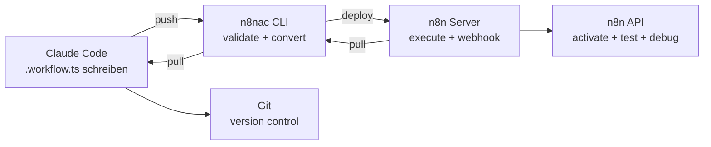
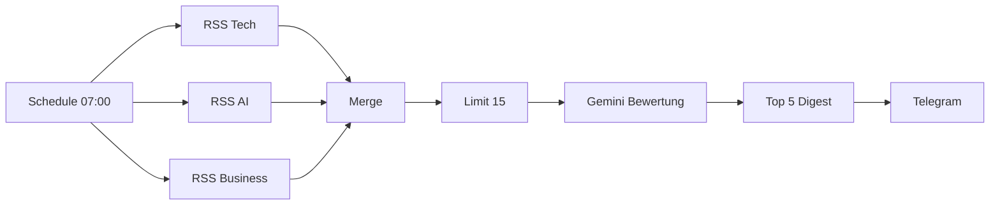
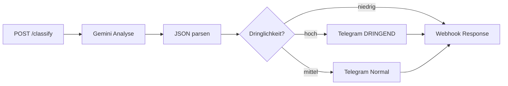
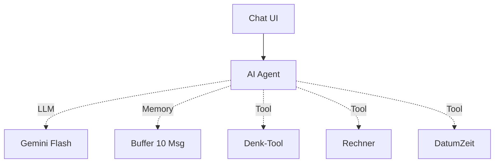
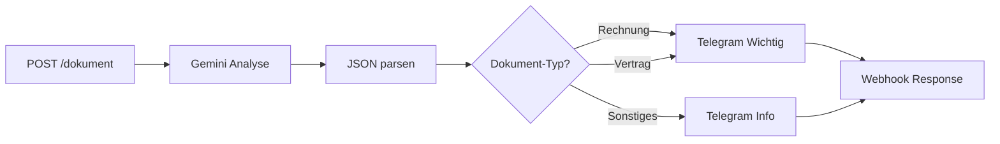
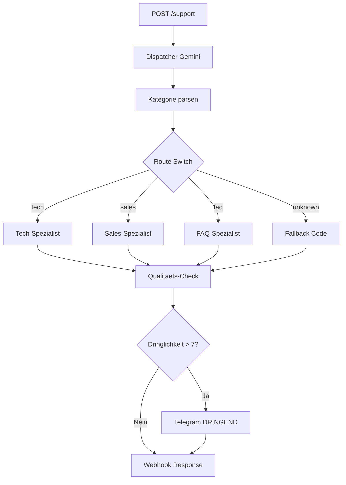
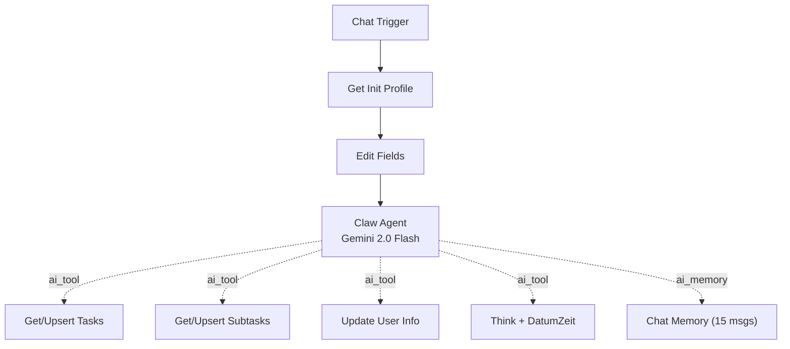
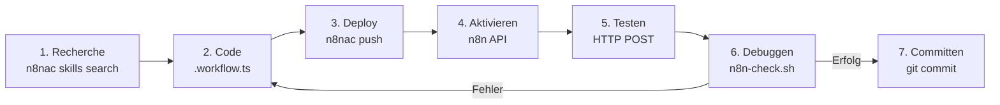

# n8n-autopilot: AI-Workflow-Automatisierung mit n8n-as-code

> 5 AI-Workflows, vollstaendig als TypeScript, automatisiert gebaut und getestet
> Marius J | Stand: 2026-03-12

---

## Was ist das?

Ein Lernprojekt, das zeigt, wie man mit **n8n** + **n8n-as-code (n8nac)** komplexe
AI-Workflows vollstaendig code-first entwickelt — ohne die n8n-UI zum Bauen zu nutzen.
Alle Workflows werden als TypeScript geschrieben, per CLI deployed und automatisiert getestet.



---

## Tech-Stack

| Komponente | Tool | Version |
|------------|------|---------|
| Workflow-Engine | n8n (Self-Hosted) | 2.11.2 |
| Code-First CLI | n8n-as-code (n8nac) | 1.0.0 |
| AI / LLM | Google Gemini Flash | 2.0-flash (Free Tier) |
| Benachrichtigungen | Telegram Bot | @n8nac_TG_bot |
| Test-Automation | Python + n8n REST API | Custom Scripts |
| Versionierung | Git | lokal |
| Editor | VS Code + n8nac Extension | - |
| Kosten | **0 EUR** | Alles Free Tier |

---

## Die 6 Workflows

### WF1: AI News-Kurator



- **Nodes:** 10 | **Trigger:** Schedule | **Test:** Manuell in UI
- **Konzepte:** Schedule Trigger, 3 parallele RSS Feeds, AI-Bewertung, Score-Sortierung, Telegram Digest

### WF2: AI Text-Assistent



- **Nodes:** 8 | **Trigger:** Webhook | **Test:** Automatisiert (HTTP POST)
- **Konzepte:** Webhook I/O, chainLlm, Code Node JSON-Extraktion, Switch 3-Wege-Routing

### WF3: AI Personal Agent



- **Nodes:** 7 | **Trigger:** Chat | **Test:** n8n Chat UI
- **Konzepte:** Agent Node, Function Calling, 3 Tools, Buffer Memory, `.uses()` fuer AI Sub-Nodes

### WF4: AI Dokument-Pipeline



- **Nodes:** 8 | **Trigger:** Webhook | **Test:** Automatisiert (HTTP POST)
- **Konzepte:** Dokument-Klassifizierung, Structured Output (Typ/Absender/Betrag), Multi-Branch Routing

### WF5: AI Multi-Agent Support System



- **Nodes:** 16 | **Trigger:** Webhook | **Test:** Automatisiert (4 Szenarien)
- **Konzepte:** Dispatcher-Pattern, 4 Gemini LLMs, Multi-Agent-Orchestrierung, Qualitaets-Scoring, Conditional Alerts

### WF6: AI Personal Assistant (n8nClaw)



- **Nodes:** 13 | **Trigger:** Chat (Telegram geplant) | **Test:** Chat UI
- **Konzepte:** Persoenlicher Assistent, Onboarding-Flow (username/soul/user), Task-Management via DataTables, basiert auf [n8nClaw](https://github.com/shabbirun/n8nclaw) (MIT)
- **Phasen:** Phase 1 (Chat+Tasks) aktiv, Phase 2-6 geplant (Telegram, Media, Heartbeat, RAG, Sub-Agents)

---

## Automatisierte Test-Pipeline

Webhook-basierte Workflows (WF2, WF4, WF5) werden vollautomatisch getestet:

```bash
# 1. Workflow schreiben und pushen
npx n8nac push 05-ai-multi-agent-support.workflow.ts

# 2. Aktivieren + Webhook registrieren (via n8n API)
python -c "... activate → deactivate → activate ..."

# 3. Test-Payloads senden
python -c "... POST /webhook/support {text, user, channel} ..."

# 4. Ergebnisse pruefen
bash n8n-check.sh pDLr3eWlGs9ebf79 4

# 5. Bei Fehler: Code fixen → push → retest
# 6. Bei Erfolg: git commit
```

Das Skript `n8n-check.sh` liest Execution-Details via n8n REST API und zeigt
pro Node: OK/FAIL, Error-Messages und Output-Previews.

---

## Projektstruktur

```
n8n-autopilot/
├── README.md                          # Diese Datei
├── AGENTS.md                          # Auto-generiert (n8nac AI-Kontext)
├── n8n-check.sh                       # Execution-Checker Script
├── check-secrets.sh                   # Credential-Leak-Schutz
├── n8nac-config.json                  # n8nac Konfiguration
├── n8nClaw.json                       # Original-Template (80 Nodes, MIT)
├── .github/
│   ├── workflows/pages.yml            # GitHub Pages Auto-Deploy
│   └── ISSUE_TEMPLATE/                # Bug Report + Feature Request
├── docs/
│   ├── index.html                     # GitHub Pages Site (Mermaid-Diagramme)
│   ├── referenz/
│   │   ├── n8n-referenz.md            # n8n Plattform-Referenz
│   │   ├── n8nac-referenz.md          # n8n-as-code CLI Referenz
│   │   └── template-referenz.md       # Template-Analyse + Empfehlungen
│   ├── n8nclaw/
│   │   ├── n8nClaw-referenz.md        # WF6 Architektur + Implementierungsplan
│   │   └── n8nClaw-original-prompts.md # Verbatim Prompts aus Template
│   └── planung/
│       ├── lern-pipeline.md           # Urspruenglicher Lernplan (WF1-WF4)
│       └── next-wf-vorschlag.md       # WF5-Entwurf (umgesetzt)
└── workflows/
    └── local_5678_marius _j/
        └── personal/
            ├── 01-ai-news-kurator.workflow.ts
            ├── 02-ai-text-assistent.workflow.ts
            ├── 03-ai-personal-agent.workflow.ts
            ├── 04-ai-dokument-pipeline.workflow.ts
            ├── 05-ai-multi-agent-support.workflow.ts
            └── 06-ai-personal-assistant.workflow.ts   # WF6 (n8nClaw Phase 1)
```

---

## Zusammenfassung der bisherigen Taetigkeit

### Phase 1: Setup & Grundlagen
- n8n lokal installiert (npm, localhost:5678)
- n8n-as-code CLI + VS Code Extension konfiguriert
- Credentials angelegt: Google Gemini (Free Tier), Telegram Bot
- Referenzdokumente erstellt (docs/referenz/)
- Lernplan mit 4 Workflows entworfen (docs/planung/lern-pipeline.md)

### Phase 2: Einfache Workflows (WF1-WF2)
- **WF1:** Schedule-basierter News-Kurator mit RSS + AI-Bewertung
- **WF2:** Webhook-basierter Text-Assistent mit Klassifizierung
- **Erkenntnis:** Gemini Free Tier funktioniert zuverlaessig als OpenAI-Ersatz
- **Erkenntnis:** n8nac push-Dateiname OHNE Pfad, nur Dateiname

### Phase 3: AI Agents & Tools (WF3)
- Erster Agent-Workflow mit Chat-Interface
- **Problem:** Gemini Function Calling braucht `type: OBJECT` Schema
- **Loesung:** Built-in `toolThink` durch `toolCode` mit explizitem `inputSchema` ersetzt
- **Problem:** Code-Tool ohne Input schlaegt fehl
- **Loesung:** `required: ["query"]` + Prompt-Hinweis "uebergib beliebigen Text"

### Phase 4: Vollautomatisierung (WF4)
- Erster Workflow komplett ohne manuelles Einwirken gebaut, getestet und debuggt
- Test-Pipeline entwickelt: `n8n-check.sh` + Python Webhook-Tests + API Activation
- 3/3 Tests auf Anhieb bestanden — Zero Manual Fixes

### Phase 5: Komplexer Multi-Agent Workflow (WF5)
- 16 Nodes, 4 Gemini LLMs, Dispatcher-Pattern
- **Bug 1:** Regex-Escaping in jsCode (TS→JSON→JS Kette unzuverlaessig)
  - Fix: `indexOf`/`lastIndexOf` statt Regex fuer JSON-Extraktion
- **Bug 2:** Telegram "can't parse entities" bei abgeschnittenem Markdown
  - Fix: `split("*").join("")` vor dem Senden
- 4/4 Test-Szenarien bestanden nach 2 Fixes

### Gelernte Patterns

| Pattern | Beschreibung |
|---------|-------------|
| Dispatcher + Switch | AI klassifiziert, Switch routet zu Spezialisten |
| chainLlm + Code Parse | LLM-Antwort → JSON extrahieren → strukturiert weiter |
| `.uses()` fuer AI | LLM/Memory/Tools IMMER via `.uses()`, nie `.out().to()` |
| `$('Node')` Referenz | Daten von frueheren Nodes ueber Branches hinweg |
| Webhook + responseNode | Async-Verarbeitung mit synchroner HTTP-Antwort |
| Conditional Telegram | If-Node fuer bedingte Benachrichtigungen |

---

## Ausblick: Ist jeder Automatisierungs-Usecase vollautomatisiert denkbar?

### Kurze Antwort: Ja — mit Einschraenkungen.

Die Kombination aus **n8nac CLI** + **n8n REST API** + **Claude Code** ermoeglicht
einen vollstaendig automatisierten Entwicklungszyklus:



> Alles ohne einen einzigen Klick in der n8n UI.

### Was geht vollautomatisch?

| Aspekt | Status | Details |
|--------|--------|---------|
| Workflow bauen | Voll | TypeScript schreiben + push |
| Node-Recherche | Voll | `skills search`, `node-info`, `examples` |
| Deployment | Voll | `push` + API activate |
| Webhook-Tests | Voll | HTTP POST + Response validieren |
| Error-Analyse | Voll | `n8n-check.sh` liest Execution-Details |
| Debug-Zyklus | Voll | Fehler erkennen → Code fixen → re-push |
| Chat-Tests | Teilweise | Chat Trigger braucht n8n-interne API (nicht exponiert) |
| OAuth-Credentials | Manuell | Google/Slack/etc. brauchen Browser-Auth |
| Schedule-Trigger | Teilweise | Ausloesung per API moeglich, aber nicht trivial |
| Binary Data (PDF) | Teilweise | Upload per Webhook moeglich, aber Setup noetig |

### Kernprinzip fuer volle Automatisierung

> **Design-Regel:** Jeder Workflow, der als Webhook-basiert konzipiert wird,
> kann vollstaendig automatisiert entwickelt, deployed, getestet und debuggt werden.

Das bedeutet: Selbst Use-Cases, die "eigentlich" einen Email-Trigger oder Schedule
brauchen, koennen fuer die Entwicklung als Webhook gebaut und getestet werden.
Den Trigger tauscht man erst am Ende aus.

---

## 10 Bereiche zum Vertiefen

### 1. DevOps & Infrastructure Monitoring

AI-gestuetzte Server-Ueberwachung mit automatischer Incident-Response.

**Use Cases:**
- Webhook empfaengt Alerts von Prometheus/Grafana → AI analysiert → Runbook-Vorschlaege
- Log-Analyse: Logs per Webhook einliefern → Gemini erkennt Muster → Alert bei Anomalien
- Deployment-Pipeline: GitHub Webhook → Build Status → Rollback-Entscheidung per AI
- Uptime-Monitoring mit eskalierenden Benachrichtigungen (Info → Warning → Critical)

**Neue Konzepte:** HTTP Request Node (API-Calls), Error Workflows, Retry-Logik, Webhooks verketten

---

### 2. Content & Social Media Automation

AI-generierte Inhalte fuer mehrere Plattformen mit Qualitaetskontrolle.

**Use Cases:**
- Blog-Artikel → AI kuerzt auf Twitter/LinkedIn/Instagram-Laenge → Zeitversetzt posten
- RSS-Monitoring von Wettbewerbern → AI-Zusammenfassung → interner Newsletter
- YouTube-Transkript per API → AI erstellt Blog-Post + Social-Media-Snippets
- Kommentar-Monitoring: Social-Media-Mentions → Sentiment-Analyse → Eskalation

**Neue Konzepte:** OAuth2-Flows, Scheduling, Rate-Limiting, Multi-Output-Formate

---

### 3. E-Commerce & Bestell-Automatisierung

Intelligente Bestellverarbeitung mit AI-gestuetzter Entscheidungsfindung.

**Use Cases:**
- Neue Bestellung → AI prueft auf Betrug (Muster, Adresse, Betrag) → Auto-Approve/Flag
- Retouren-Anfrage → AI klassifiziert Grund → automatische Gutschrift oder Rueckfrage
- Lagerbestand-Alert → AI berechnet Nachbestellmenge basierend auf Trend
- Kundenbewertungen → Sentiment-Analyse → Negative an Support, Positive an Marketing

**Neue Konzepte:** Datenbank-Nodes (MySQL/Postgres), Loop Over Items, Aggregation

---

### 4. HR & Recruiting Automation

AI-gestuetztes Bewerbermanagement und Onboarding.

**Use Cases:**
- Bewerbung per Webhook → AI extrahiert Skills → Matching mit Stellenprofil → Scoring
- Interview-Terminplanung: Verfuegbarkeit pruefen → Kalender-Eintrag → Einladung senden
- Onboarding-Checkliste: Neuer Mitarbeiter → 20 automatische Setup-Schritte auslösen
- Exit-Interview-Analyse: Freitext → AI kategorisiert Kuendigungsgruende → Trend-Report

**Neue Konzepte:** Google Calendar API, Multi-Step Workflows, Conditional Branching

---

### 5. Finanz-Operationen & Buchhaltung

Automatisierte Finanzdaten-Verarbeitung mit AI-Analyse.

**Use Cases:**
- Rechnungs-PDF per Webhook → AI extrahiert Felder → Google Sheets Buchhaltung
- Monatlicher Ausgaben-Report: Sheets aggregieren → AI analysiert Trends → Empfehlungen
- Zahlungserinnerungen: Faellige Rechnungen → Eskalationsstufen → Mahnung generieren
- Wechselkurs-Monitoring → AI bewertet Zeitpunkt fuer Ueberweisungen

**Neue Konzepte:** Google Sheets CRUD, PDF-Verarbeitung, Scheduled Reports, Math-Operations

---

### 6. Customer Service & Helpdesk (Erweiterung von WF5)

Multi-Channel-Support mit lernenden AI-Agenten.

**Use Cases:**
- Ticket-System: Email/Webhook/Telegram → AI-Triage → Routing → SLA-Tracking
- FAQ-Bot mit Wissensbasis: Vordefinierte Antworten + AI-Fallback fuer neue Fragen
- Eskalations-Management: Stimmung erkennen → Auto-Eskalation bei negativem Sentiment
- Customer-Satisfaction: Nach Loesung AI-generierte Zufriedenheits-Umfrage senden

**Neue Konzepte:** Memory/Session-Management, Wissensbasis als Tool, SLA-Timer, CSAT-Scoring

---

### 7. Daten-Pipeline & ETL

AI-gestuetzte Datentransformation und -integration.

**Use Cases:**
- CSV/JSON per Webhook → AI bereinigt Datenqualitaet → normalisiert → Ziel-System
- Multi-Source-Merge: 3 APIs abfragen → AI dedupliziert → einheitliches Format
- Data-Enrichment: Firmennamen → AI reichert mit Branche/Groesse/Land an
- Schema-Migration: Altes Format → AI mapped auf neues Schema → Validierung

**Neue Konzepte:** Split In Batches, Merge-Strategien, HTTP Request Node, Code-Node-Power

---

### 8. IoT & Smart Home Automation

Sensor-Daten verarbeiten und intelligente Aktionen auslösen.

**Use Cases:**
- Sensor-Webhook → Schwellwert-Check → AI bewertet Kontext → Smart-Aktion
- Energieverbrauch-Monitoring → AI erkennt Anomalien → Spar-Empfehlungen
- Wetter-API + Kalender → AI plant optimale Heizung/Kuehlung
- Geraete-Status-Dashboard: Webhook-Aggregation → HTML-Report → Telegram

**Neue Konzepte:** Webhook-Streams, Time-Series-Analyse, Externe APIs, HTML-Generierung

---

### 9. Legal & Compliance

AI-gestuetzte Vertrags- und Compliance-Pruefung.

**Use Cases:**
- Vertrag per Webhook → AI extrahiert Klauseln → Risiko-Bewertung → Flagging
- DSGVO-Check: Neue Datenverarbeitung beschreiben → AI prueft Compliance → Checkliste
- Vertragsvergleich: 2 Versionen einliefern → AI identifiziert Aenderungen → Summary
- Fristenueberwachung: Vertragsdaten → Reminder vor Ablauf → AI-Empfehlung (kuendigen/verlaengern)

**Neue Konzepte:** Lange Texte (Chunking), Vergleichs-Analyse, Deadline-Tracking, PDF-I/O

---

### 10. Bildung & Lern-Management

AI-gestuetzte Lerninhalte und Wissensmanagement.

**Use Cases:**
- Lernmaterial einliefern → AI erstellt Zusammenfassung + Quiz-Fragen → Karteikarten
- Frage per Webhook → AI sucht in Wissensbasis → Erklaerung mit Beispielen
- Fortschritts-Tracking: Quiz-Ergebnisse → AI identifiziert Schwaechen → Lernplan anpassen
- Meeting-Protokoll per Webhook → AI extrahiert Action Items → Aufgaben zuweisen

**Neue Konzepte:** RAG (Retrieval Augmented Generation), Vector Stores, Langchain-Integration

---

## Naechste Schritte

**Infrastruktur (erledigt):**
- ~~GitHub Pages~~ — Live unter [mj-deving.github.io/n8n-autopilot](https://mj-deving.github.io/n8n-autopilot/)
- ~~Mermaid-Diagramme~~ — Alle Workflow-Flows als Mermaid im README + Pages
- ~~Secret-Check~~ — Pre-Commit Hook blockiert Credentials automatisch
- ~~Issue Templates~~ — Bug Reports + Feature Requests mit WF-Dropdown

**Naechste Workflows:**
1. **Ollama auf VPS** — Lokales LLM als Fallback bei Gemini Rate-Limits
2. **Google Sheets Integration** — Logging und Reporting fuer alle Workflows
3. **Error Workflows** — Zentrale Fehlerbehandlung mit Retry-Logik
4. **RAG / Vector Store** — Wissensbasis fuer FAQ- und Support-Agenten
5. **Multi-Channel** — Telegram-Eingang zusaetzlich zu Webhook

---

## Referenz-Dokumente

### Nachschlagewerke (`docs/referenz/`)
| Datei | Inhalt |
|-------|--------|
| [n8n-referenz.md](docs/referenz/n8n-referenz.md) | n8n Plattform: Architektur, Nodes, Expressions, AI |
| [n8nac-referenz.md](docs/referenz/n8nac-referenz.md) | n8n-as-code CLI: Alle Befehle, Syntax, Gotchas |
| [template-referenz.md](docs/referenz/template-referenz.md) | Template-Analyse: Was uebernommen, was empfohlen |

### n8nClaw / WF6 (`docs/n8nclaw/`)
| Datei | Inhalt |
|-------|--------|
| [n8nClaw-referenz.md](docs/n8nclaw/n8nClaw-referenz.md) | WF6 Architektur, Implementierungsplan (6 Phasen) |
| [n8nClaw-original-prompts.md](docs/n8nclaw/n8nClaw-original-prompts.md) | Verbatim Prompts, Tool-Configs, Delta-Tabelle |

### Planung (`docs/planung/`)
| Datei | Inhalt |
|-------|--------|
| [lern-pipeline.md](docs/planung/lern-pipeline.md) | Urspruenglicher 4-Workflow-Lernplan |
| [next-wf-vorschlag.md](docs/planung/next-wf-vorschlag.md) | WF5-Entwurf (umgesetzt) |

---

*Stand: 2026-03-19 | 6 Workflows mit Google Gemini Free Tier (0 EUR)*
