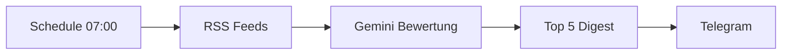

# Template-Referenz: n8n-workflow-template

> Was das Template-Repo bietet, was wir uebernommen haben und was fuer die Zukunft empfohlen wird.
>
> Quelle: [github.com/jeremylongshore/n8n-workflow-template](https://github.com/jeremylongshore/n8n-workflow-template)

---

## 1. Was ist das Template?

Ein GitHub-Template-Repository fuer die professionelle Veroeffentlichung einzelner n8n-Workflows.
Die Idee: **Ein Repo = ein Workflow**, fertig verpackt mit Dokumentation, Diagrammen und CI.

```
Gedacht fuer:
┌─────────────────────────────────────────────┐
│  Community-Sharing einzelner Workflows      │
│  n8n-Marketplace-Beitraege                  │
│  Open-Source-Workflow-Projekte              │
└─────────────────────────────────────────────┘

Unser Projekt (n8n-autopilot):
┌─────────────────────────────────────────────┐
│  Multi-Workflow-Monorepo (5 WFs)            │
│  Code-First mit n8n-as-code (TypeScript)    │
│  Automatisierte Test-Pipeline               │
└─────────────────────────────────────────────┘
```

Das Template passt also nicht 1:1 — aber viele Bausteine sind einzeln sehr nuetzlich.

---

## 2. Was bietet das Template?

### Komplette Dateistruktur

```
n8n-workflow-template/
├── .beads/                    ← Issue-Tracker fuer AI-Agenten (Codex/Claude)
│   ├── config.yaml
│   ├── issues.jsonl
│   └── metadata.json
├── .github/
│   ├── ISSUE_TEMPLATE/
│   │   ├── bug_report.yml     ← Strukturierter Bug-Report (n8n-Version, Deployment-Typ)
│   │   ├── feature_request.yml
│   │   └── workflow_help.yml  ← Hilfe-Anfragen
│   └── workflows/
│       └── pages.yml          ← GitHub Actions: Auto-Deploy docs/ auf GitHub Pages
├── assets/                    ← Screenshots, Bilder
├── docs/
│   └── index.html             ← GitHub Pages Site (Dark Theme, Mermaid-Diagramme)
├── workflow/
│   ├── README.md              ← Anleitung zum Ersetzen der Vorlage
│   └── workflow.json          ← Platzhalter n8n-Export (Start → Code Node)
├── .gitattributes             ← Merge-Driver fuer Beads
├── .gitignore                 ← Credentials, .env, node_modules, OS-Files
├── @AGENTS.md                 ← Instruktionen fuer AI-Coding-Agenten
├── AGENTS.md                  ← Erweiterte Agenten-Instruktionen
├── LICENSE                    ← MIT
├── README.md                  ← Haupt-Dokumentation mit Platzhalter-Sektionen
└── package.json               ← npm Scripts: validate + check-secrets
```

### Kern-Features im Detail

| Feature | Was es tut | Wie es funktioniert |
|---------|-----------|---------------------|
| **Mermaid-Diagramme** | Workflow-Flows visuell darstellen | `graph LR` Syntax in README + docs/index.html, GitHub rendert nativ |
| **GitHub Pages** | Professionelle Projekt-Website | `docs/index.html` wird automatisch per GitHub Actions deployed |
| **Issue Templates** | Strukturierte Bug-Reports | YAML-Formulare mit Dropdowns (n8n-Version, Deployment-Typ, Komponente) |
| **Secret-Check** | Verhindert versehentliches Committen von Credentials | `npm run check-secrets` grepped nach password/token/secret/key in workflow.json |
| **Workflow-Validierung** | JSON-Syntax pruefen | `npm run validate` prueft workflow.json via `jq` |
| **Beads Integration** | Issue-Tracking fuer AI-Agenten | CLI-Tool (`bd`) das Codex/Claude Tasks zuweisen kann |
| **README-Vorlage** | Einheitliche Doku-Struktur | Platzhalter: Overview, Prerequisites, Installation, Architecture, Troubleshooting |
| **.gitignore** | Sauberes Repo | Credentials, .env, node_modules, OS-Files, IDE-Dateien |

### README-Sektionen (Vorlage)

Die README des Templates ist als Ausfuell-Vorlage gedacht:

```
1. Overview          → "Dieser Workflow macht..."
2. Workflow Diagram  → Mermaid graph LR
3. Prerequisites     → n8n-Version, Credentials, API Keys
4. Installation      → wget + n8n import
5. Configuration     → Env-Vars, Trigger-Typ, Timeout
6. Usage             → Basic + Advanced Schritte
7. Architecture      → Key Components Tabelle
8. Troubleshooting   → Haeufige Probleme + Loesungen
```

---

## 3. Was haben wir uebernommen?

### Direkt uebernommen und angepasst

```
Template (1 Workflow)              n8n-autopilot (5 Workflows)
─────────────────────              ──────────────────────────────

docs/index.html                →   docs/index.html
  Einzelner Workflow                 Alle 5 WFs mit Mermaid-Diagrammen
  Englisch                           Deutsch
  Platzhalter                        Echte Daten aus unseren .workflow.ts

.github/workflows/pages.yml   →   .github/workflows/pages.yml
  Branch: main                       Branch: master

.github/ISSUE_TEMPLATE/        →   .github/ISSUE_TEMPLATE/
  bug_report.yml                     bug_report.yml (WF1-WF5 Dropdown)
  feature_request.yml                feature_request.yml (WF6+ Vorschlaege)
  workflow_help.yml                  (nicht uebernommen — wir sind kein Community-Projekt)

.gitignore                     →   .gitignore (erweitert)
  Basics                             + Credentials, OS, IDE, .n8n/
```

### Was sich konkret geaendert hat

**docs/index.html** — komplett neu geschrieben fuer Multi-Workflow:
- Navigation mit Sprungmarken zu allen 5 WFs
- Mermaid-Diagramme fuer jeden Workflow (akkurat aus den .workflow.ts abgeleitet)
- Tech-Stack Uebersicht
- Gelernte Patterns (Dispatcher+Switch, chainLlm+Code, .uses(), etc.)
- Gotchas-Tabelle (Gemini Tools, n8nac push, Webhook-Registrierung, etc.)
- Test-Snippets mit echten Python-Befehlen

**Issue Templates** — angepasst auf unser Projekt:
- Dropdown mit WF1-WF5 statt generischem "Workflow Name"
- Komponenten-Dropdown (Webhook, AI/LLM, Code Node, Switch, Telegram, n8nac CLI)
- Feature Requests mit Prioritaet und Flow-Beschreibung

---

## 4. Was haben wir NICHT uebernommen (und warum)?

| Feature | Grund |
|---------|-------|
| **workflow/workflow.json** | Wir nutzen n8n-as-code (TypeScript), nicht JSON-Export |
| **Beads (.beads/)** | Zusaetzliches Tool mit wenig Mehrwert fuer unser Setup |
| **@AGENTS.md** | Wir haben bereits AGENTS.md (auto-generiert von n8nac) |
| **package.json Scripts** | `validate` braucht jq + JSON — wir haben TypeScript. `check-secrets` ist gute Idee (siehe Empfehlungen) |
| **LICENSE (MIT)** | Noch nicht entschieden ob/wie lizenziert |
| **workflow_help.yml** | Template fuer Community-Support — nicht relevant fuer persoenliches Lernprojekt |
| **assets/ Ordner** | Screenshots koennen spaeter bei Bedarf ergaenzt werden |

---

## 5. Empfehlungen fuer die Zukunft

### Kurzfristig (naechste Session)

**1. GitHub Pages aktivieren**

Nach dem naechsten Push:
```
GitHub Repo → Settings → Pages → Source: "GitHub Actions"
```
Ergebnis: `https://mj-deving.github.io/n8n-autopilot/`

**2. Secret-Check als Pre-Commit Hook**

Statt `npm run check-secrets` aus dem Template:
```bash
# Einfacher grep-basierter Check vor jedem Commit
# In .git/hooks/pre-commit oder als Claude Code Hook
grep -rn "password\|secret\|api_key\|token" workflows/ --include="*.ts" \
  | grep -v "credentials:" | grep -v "//.*secret"
```

Oder als n8nac-spezifische Variante — die Credential-IDs in den .workflow.ts sind okay
(sie verweisen nur auf n8n-interne IDs, nicht auf die echten Secrets).

### Mittelfristig (naechste Workflows)

**3. Per-Workflow Detail-Seiten**

Wenn das Projekt waechst (WF6+), lohnt sich eine Aufspaltung:
```
docs/
├── index.html              ← Uebersicht + Navigation
├── wf1-news-kurator.html   ← Detail: Nodes, Config, Beispiel-Output
├── wf2-text-assistent.html
└── ...
```

**4. Mermaid-Diagramme im README**

GitHub rendert Mermaid nativ in Markdown. Die ASCII-Diagramme im README koennten
durch Mermaid-Bloecke ersetzt werden:

````markdown

````

Vorteil: Wird direkt auf GitHub gerendert, keine externe Abhaengigkeit.
Nachteil: ASCII-Diagramme funktionieren ueberall (auch in Terminals, git log, etc.).

Empfehlung: **Beides beibehalten** — Mermaid fuer GitHub-Ansicht, ASCII fuer README-Header.

**5. Workflow-Validierung automatisieren**

Das Template hat `npm run validate` fuer JSON. Fuer unseren TypeScript-Ansatz:
```bash
# TypeScript-Syntax pruefen (kein n8nac noetig)
npx tsc --noEmit --project workflows/local_5678_marius\ _j/personal/tsconfig.json
```

### Langfristig (ab 10+ Workflows)

**6. Workflow-Katalog mit Metadaten**

Eine `workflows.json` als Katalog:
```json
[
  {
    "id": "WF1",
    "name": "AI News-Kurator",
    "file": "01-ai-news-kurator.workflow.ts",
    "n8nId": "5bWFv8sC4a3OvMgP",
    "trigger": "schedule",
    "nodes": 10,
    "testable": false,
    "tags": ["rss", "ai", "telegram", "digest"]
  }
]
```
Kann fuer automatische README-Generierung, Suche und Filterung genutzt werden.

**7. Changelog pro Workflow**

Wenn Workflows iteriert werden (v2, v3, etc.):
```markdown
## WF5 - AI Multi-Agent Support

### v1.0 (2026-03-11)
- Initial: 16 Nodes, 4 Gemini, Dispatcher-Pattern

### v1.1 (geplant)
- RAG-Wissensbasis fuer FAQ-Spezialist
- Session-Memory fuer wiederkehrende User
```

**8. Community-Beitrag: Einzelne Workflows als eigenes Template-Repo**

Wenn ein Workflow besonders gut ist (z.B. WF5 Multi-Agent Support),
kann er als eigenes Repo nach dem Template-Muster veroeffentlicht werden:
```
mj-deving/n8n-multi-agent-support
├── workflow/workflow.json    ← n8nac export
├── docs/index.html           ← Einzelne Doku-Seite
├── README.md                 ← Template-Format
└── ...
```

---

## 6. Vergleich: Unser Ansatz vs. Template-Ansatz

```
                    Template                    n8n-autopilot
                    ────────                    ──────────────
Struktur            1 Repo = 1 Workflow         1 Repo = N Workflows
Workflow-Format     JSON Export                  TypeScript (n8n-as-code)
Dokumentation       README + Pages              README + Pages + Referenzen
Diagramme           Mermaid (Platzhalter)       Mermaid (echte Flows)
Tests               Keine                        Automatisiert (Webhook + API)
CI/CD               Pages Deploy                 Pages Deploy
Issue Tracking      Beads + GitHub Issues        GitHub Issues
Zielgruppe          Community/Marketplace        Persoenliches Lernprojekt
```

### Staerken des Templates, die wir nutzen
- Professionelle GitHub Pages Praesentation
- Strukturierte Issue Templates mit n8n-spezifischen Feldern
- Mermaid-Diagramme als Standard fuer Workflow-Visualisierung
- Saubere .gitignore mit Credential-Schutz

### Staerken unseres Ansatzes, die das Template nicht hat
- TypeScript statt JSON (typsicher, versionierbar, diffbar)
- Automatisierte Test-Pipeline (Webhook POST + n8n-check.sh)
- Multi-Workflow-Management in einem Repo
- Referenz-Dokumentation (n8n-referenz.md, n8nac-referenz.md)
- Gelernte Patterns und Gotchas dokumentiert

---

*Erstellt am 2026-03-12 | Basierend auf [n8n-workflow-template](https://github.com/jeremylongshore/n8n-workflow-template) (MIT License)*
